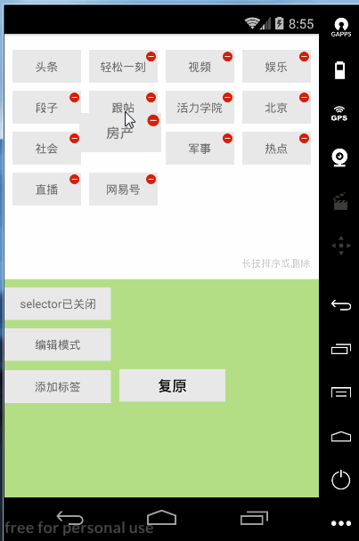

# HandyGridView

HandyGridView本质上是一个GridView，所以你也可以当成普通的GridView来使用，HandyGridView继承了GridView并在此之上添加了item拖动和交换，绘制图文等功能。
由于只是一个GridView，所以性能比目前其他的可拖动的gridview解决方案都要好。

---

### 效果图

 

---
### Usage

#### minSdkVersion 11

#### HandyGridView的三种模式：

Mode | introduction 
---|---
TOUCH | 编辑模式，此模式下item可以自由拖动
LONG_PRESS | 长按拖动模式，此模式下item在长按以后可以自由拖动
NONE | 此模式下item不可拖动，可当成正常的GridView使用

示例如下：

```
HandyGridView#setMode(TOUCH|LONG_PRESS|NONE);

```
---

#### Adapter

HandyGridView会在item被拖动交换时发出通知，如果想要做出对应数据上的变化，则可以在Apdater中实现OnItemMovedListener，示例如下：

```

public class GridViewAdapter extends BaseAdapter implements OnItemMovedListener｛
    @Override
    public void onItemMoved(int from, int to) {
        String s = mDatas.remove(from);
        mDatas.add(to, s);
    }

    @Override
    public boolean isFixed(int position) {
        //此时0位置为固定的，不可拖动
        if (position == 0) {
            return true;
        }
        return false;
    }
｝
```

---
#### 绘制图文
HandyGridView提供了在gridview上绘制图文的接口，示例如下：

```
    mGridView.setDrawer(new IDrawer() {
            @Override
            public void onDraw(Canvas canvas, int width, int height) {
                if (!mGridView.isNoneMode()) {
                    int offsetX = -DensityUtil.dip2px(MainActivity.this, 10);
                    int offsetY = -DensityUtil.dip2px(MainActivity.this, 10);
                    //文字绘制于gridview的右下角，并向左，向上偏移10dp。
                    drawTips(canvas, width + offsetX, height + offsetY);
                }
            }
        },false);

    private void drawTips(Canvas canvas, int width, int height) {
        if (mTextPaint == null) {
            mTextPaint = new TextPaint();
            mTextPaint.setColor(Color.parseColor("#CFCFCF"));
            mTextPaint.setTextSize(DensityUtil.dip2px(MainActivity.this, 12));
            Paint.FontMetrics fontMetrics = mTextPaint.getFontMetrics();
            textHeight = (int) (fontMetrics.bottom - fontMetrics.top) + 1;
            textWidth = (int) mTextPaint.measureText(paintText) + 1;
        }
        width = width - textWidth;
        height = height - textHeight;
        if (tipsLayout == null) {
            tipsLayout = new StaticLayout(paintText, mTextPaint, width, Layout.Alignment.ALIGN_NORMAL, 1.5f, 0f, false);
        }
        canvas.translate(width, height);
        tipsLayout.draw(canvas);
    }

```
---

以上就是主要的用法了,[更多的用法可以参考example](https://github.com/huxq17/HandyGridView/blob/master/app/src/main/java/com/handygridview/example/MainActivity.java).

### LICENSE

[Apache License 2.0](LICENSE)


